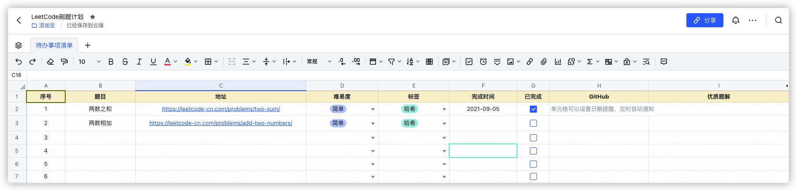

# 毕业总结

## 收获
1. 20次课程，一套完整的“数据结构+算法+LeetCode刷题”的知识和方法论。李东旭老师
2. 刷题的代码[模板](https://u.geekbang.org/lesson/158?article=392288)
3. “左耳朵耗子”陈皓老师分享的[毕业刷题路线](https://u.geekbang.org/lesson/158?article=392323)，共计70道题。
4. 如何快速的通过PyCharm 模板进行LeetCode刷题

## 不足之处
1. 作业的完成度不够，每次只是完成了基本的作业习题，还闹了乌龙：自己提交代码到了本地，没有推送到GitHub，导致助教返工。
2. 视频的观看次数低，每个视频只看过一遍（钉钉），需要刷多遍才可以。
3. 代码量低，很多的题目不看LeetCode题解的情况下，根本没有思路。需要总结必要的刷题技巧+模板。

## 下一步计划
1. 明确目标和DeadLine
2. 指定刷题计划，并跟进。链接🔗如下（目前需要补充中）：https://miraclewong.feishu.cn/sheets/shtcnw6cG6XhxOgCc4J53PSdIGc 

图片：

## 如何更好的刷题
方法论：
1. 对于自己没有经历过的事情，干，就完了！多想无意
2. 已经做过的事情，反思如何高效率、做的更好。需要规划。
3. 参考其他人的刷题、跳槽规划，指定符合自己的计划。

参考资料：
1. [如何刷算法题——跳槽前3个月必看](https://zhuanlan.zhihu.com/p/393018866)
2. [10W字的刷题笔记，多语言通吃](https://juejin.cn/post/6962491739500183588)
3. [如何在最短的时间内搞定数据结构和算法，应付面试? - 知乎](https://www.zhihu.com/question/28580777/answer/1864209518)
4. [Leetcode刷题顺序，看这一篇就够了 - 知乎](https://zhuanlan.zhihu.com/p/161036474)

LeetCode 题解仓库：
1. https://github.com/soulmachine/leetcode
5. https://github.com/halfrost/LeetCode-Go
